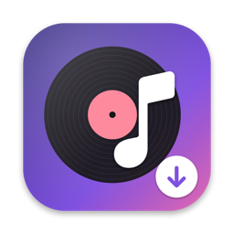
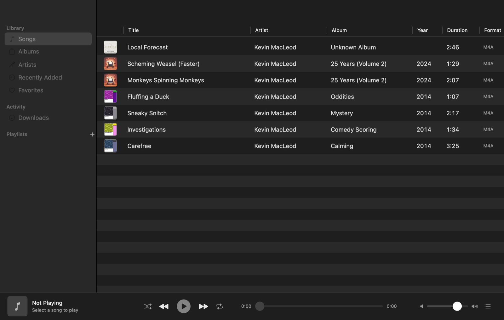
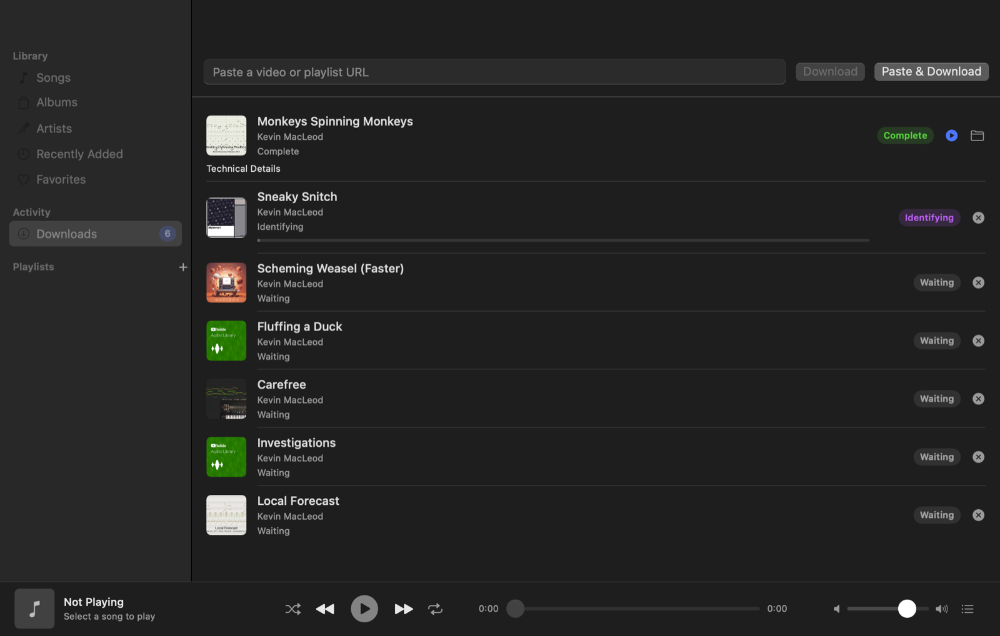
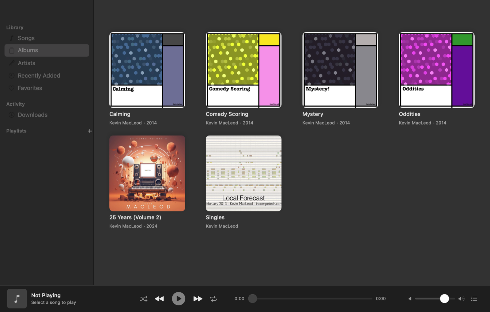
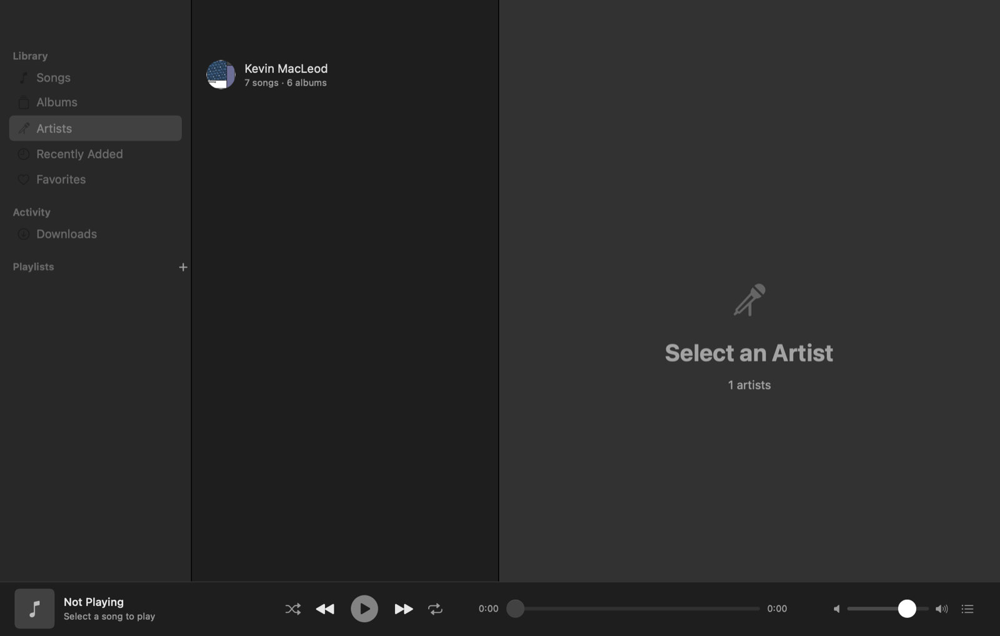
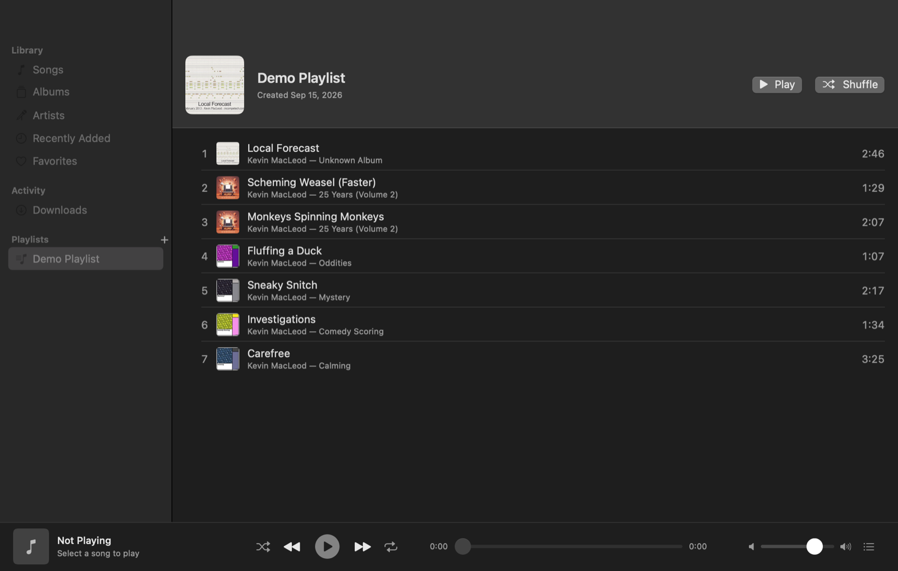
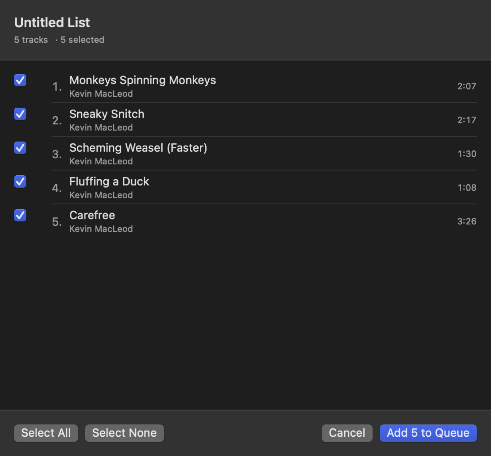
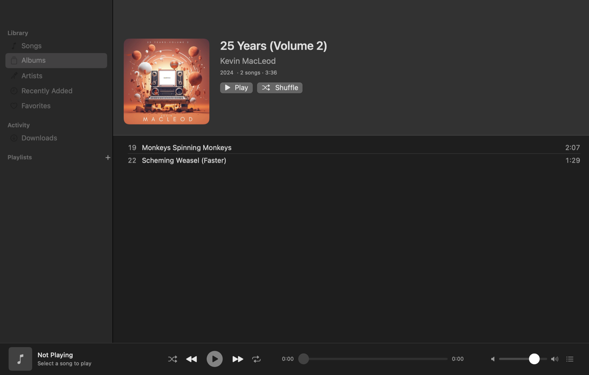

<p align="center">
  
</p>
<h1 align="center">LocalMusic</h1>
<p align="center">
  Paste a link, get a properly tagged song in a tidy folder, play it offline.<br>
  A native macOS app for building a local music library from media you're allowed to download.
</p>
<p align="center">
  
  
  
  
</p>

<p align="center">
  
</p>

## What it does

```
URL ─▶ yt-dlp ─▶ .incoming/ ─▶ identify (tags · MusicBrainz) ─▶ artwork ─▶ Artist/Year - Album/NN - Title.m4a ─▶ library
```

- **Download** single videos or whole playlists (with a preview where you can untick items). Live progress, speed, ETA, a queue with configurable concurrency, cancel and retry. Keeps the original AAC stream whenever it can; only Opus/WebM is converted, because macOS can't play it.
- **Identify** the actual recording instead of trusting the upload title: noise like *Official Video / Lyrics / 4K / Remastered* is stripped, `Artist - Title` is split, then MusicBrainz is asked and candidates are scored on title, artist, duration and release. Only confident matches are applied automatically; the rest are offered in a picker.
- **Tag** the file itself (M4A, MP3, FLAC natively; others through ffmpeg) with title, artist, album, track/disc numbers, year, genre, composer, MusicBrainz IDs and artwork from the Cover Art Archive, the embedded art, or the video thumbnail. Audio bytes are never re-encoded when tagging.
- **Organize** into `~/Music/LocalMusic/{Album Artist}/{Year} - {Album}/{NN} - {Title}.ext`, singles into `Artist/Singles/`, unidentified tracks into `Unknown Artist/Unknown Album/`. Sanitized names, case-insensitive collision handling, nothing ever escapes the library folder, nothing is ever overwritten without asking.
- **Detect duplicates** by source URL, MusicBrainz recording, artist + normalized title and duration, and let you choose Skip / Keep both / Replace / Show existing.
- **Browse and play**: Songs table, Albums grid, Artists, Recently Added, Favorites, playlists with drag-and-drop and M3U8 import/export, an Up Next queue, shuffle, repeat, media keys and the system Now Playing widget. Everything works offline.
- **Stay honest**: files are the source of truth, the index is rebuildable, logs are local, there are no accounts, no analytics and no cloud.

## Screenshots

| Downloads queue | Albums |
|---|---|
|  |  |

| Artists | Playlist |
|---|---|
|  |  |

| Playlist preview before downloading | Album detail |
|---|---|
|  |  |

## Quick start

1. **Get the app.** Either download `LocalMusic-<version>.zip` from Releases, or build it yourself (see below). The first launch of an unsigned build needs right-click → **Open**.
2. **Install ffmpeg** (one line, needed for conversion and thumbnail embedding):
   ```sh
   brew install ffmpeg
   ```
3. **Get yt-dlp.** Either `brew install yt-dlp`, or click **Download yt-dlp…** inside the app: it fetches the official standalone build from GitHub, verifies its published SHA-256, and keeps it in the app's own support folder.
4. Open **Downloads** (⌘6), paste a link, press **Download**. Watch the row go *Downloading → Processing → Identifying → Organizing → Complete*, then find the song under **Songs** (⌘1) and press Play.

Everything ends up in `~/Music/LocalMusic` (changeable in Settings). Rebuild the index any time from **Library → Rebuild Library**.

## Requirements

| | |
|---|---|
| macOS | 14 Sonoma or later, Apple Silicon or Intel (the release build is universal) |
| yt-dlp | Homebrew, or the in-app download |
| ffmpeg + ffprobe | `brew install ffmpeg` |
| fpcalc (optional) | `brew install chromaprint`, only for AcoustID fingerprinting |
| To build | Xcode 16, or just the Command Line Tools with Swift 6 |

The app searches `~/Library/Application Support/LocalMusic/bin`, `/opt/homebrew/bin`, `/usr/local/bin`, `/opt/local/bin`, `~/.local/bin` and your `PATH`; paths can be overridden in **Settings → Advanced**. **Check for Tool Updates** compares against Homebrew or the latest GitHub release and tells you what to run. The app never installs or upgrades anything on its own.

## How identification works

1. **Read what the source knows.** yt-dlp's `.info.json` (track/artist/album for YouTube Music and Topic uploads, Bandcamp, SoundCloud…) and any tags already in the file. Tags that yt-dlp itself stamped (upload title, channel name, upload year, site category) are recognised and *not* treated as real metadata.
2. **Clean the title.** Bracketed and trailing noise is removed (`(Official Video)`, `[Lyrics]`, `HD`, `4K`, `Visualizer`, `Remastered 2011`, `| Official Audio`…), `feat.` clauses are separated, a trailing `(2013)` becomes the year, and `Artist - Title` / `Artist -Title` / `Title - Artist` (when the channel matches) is split. `- Topic` and `VEVO` channel suffixes are stripped.
3. **Ask MusicBrainz.** `recording:"Jóga" AND artist:"Björk" AND dur:[290000 TO 320000]`, then a looser query if that returns nothing convincing.
4. **Score candidates** 0–1: title 35 %, artist 30 %, duration 25 %, release quality 10 %, with penalties for live/remix versions you didn't ask for and lengths that are far off. A recording whose length MusicBrainz doesn't know can be offered but never applied automatically.
5. **Pick the release** from complete data (the leaders are refreshed with a full lookup): official, non-compilation, album > EP > single, earliest date first (configurable), matching the album name when known.
6. **Apply or ask.** At or above the confidence threshold (default 85 %) the match is applied and album art comes from the Cover Art Archive. Below it, the original metadata stays and the best few candidates wait behind **Choose Match…** on the queue row or **Re-identify Metadata…** in the library.
7. **Optional fingerprint.** If both `fpcalc` and an AcoustID key (Settings → Metadata, stored in the Keychain) exist and text matching was weak, the file is fingerprinted and the returned recordings are scored too.

MusicBrainz requests carry a descriptive User-Agent, are spaced ≥ 1.1 s apart, retried with backoff on 503/429, and cached for 30 days. MusicBrainz downtime never fails a download.

## Library layout

```
~/Music/LocalMusic/
├── .incoming/                              # private per-job folders, removed after every job
├── Daft Punk/
│   └── 2013 - Random Access Memories/
│       └── 08 - Get Lucky.m4a
├── Björk/
│   └── 1997 - Homogenic/
│       └── 02 - Jóga.m4a
├── Kevin MacLeod/
│   └── Singles/
│       └── Monkeys Spinning Monkeys.m4a
└── Unknown Artist/
    └── Unknown Album/
        └── Something Unidentified.m4a
```

Folder and file templates are editable in **Settings → Organization** (`{AlbumArtist} {Artist} {Album} {Year} {Track} {Disc} {Title} {Genre}`). Each path component is sanitized (`/`, `:`, control characters, leading dots, 200-byte limit on grapheme boundaries), collisions get ` (2)` after a case-insensitive check, and every move or delete is verified to stay inside the library root. The source URL is written into the file's comment tag, so **Rebuild Library** recovers it too. Deleting from the app moves files to the Trash.

## Formats

| Setting | Result |
|---|---|
| Original (default) | The source stream, extracted without re-encoding: M4A/AAC from YouTube, MP3/FLAC from sites that serve them. Opus/WebM sources are converted to 256 kb/s AAC because AVFoundation can't play them. |
| Always M4A | Everything transcoded to AAC. |
| Always MP3 | Everything transcoded to MP3. |

Tags are written natively into M4A (passthrough export, no re-encode), MP3 (ID3v2.4, foreign frames preserved) and FLAC (Vorbis comments + PICTURE, other blocks preserved). Ogg/WAV/AIFF go through ffmpeg stream-copy.

## Building

```sh
make            # debug build → build/debug/LocalMusic.app   (no Xcode needed)
make run        # build and launch
make test       # 81 Swift Testing tests
make dist       # optimized universal build + zip → build/dist/
make install    # make dist, then copy to /Applications
make icon       # regenerate the app icon from Scripts/make-icon.swift
make xcodeproj  # generate LocalMusic.xcodeproj (needs XcodeGen)
```

The script build drives `swiftc` directly and picks a macOS SDK the installed compiler can use, so it works with a bare Command Line Tools install. `Package.swift` and `project.yml` describe the same three targets (`LocalMusicCore`, `LocalMusic`, `LocalMusicTests`) for SwiftPM and Xcode.

For distribution, sign with a Developer ID and notarize in one go:

```sh
CODESIGN_IDENTITY="Developer ID Application: Your Name (TEAMID)" NOTARY_PROFILE=localmusic make dist
# once: xcrun notarytool store-credentials localmusic --apple-id you@example.com --team-id TEAMID
```

Handy launch flags for development: `--mock` (simulated downloads that produce playable tones), `--download=<url>`, `--select=albums|artists|playlist|…`, `--screenshot=<dir>`, and `--profile=<dir>` to run against a throwaway library.

### Architecture

```
Sources/LocalMusicCore   models · services · persistence · utilities  (no SwiftUI, public API, unit-tested)
Sources/LocalMusic       App · ViewModels · Views                       (SwiftUI)
Tests/LocalMusicTests    Swift Testing suites
```

Key decisions: every tool runs through `ProcessRunner` (argument arrays, no shell, URL last after `--`); `DownloadManager` runs one task per job through *download → process → identify → organize → index*; Core Data with a programmatic model keeps the index (files stay the source of truth); `PathGuard` confines all file operations to the library; the app is intentionally not sandboxed because it must run unsigned Homebrew binaries that write into your Music folder.

## Troubleshooting

- **"Tools missing" / ffmpeg fails to run.** A Homebrew upgrade can leave ffmpeg linked against a library that's gone. `brew reinstall ffmpeg`, then **Re-check**.
- **"The site refused to serve the media (HTTP 403)".** yt-dlp is out of date; YouTube changes often. Update it (Settings → Advanced → Check for Tool Updates tells you how).
- **"Sign in to confirm you're not a bot".** YouTube is rate-limiting your network. Wait, update yt-dlp, or try another network; LocalMusic doesn't support cookies or logins.
- **Certificate errors from yt-dlp** (common on corporate networks with python.org builds of yt-dlp). The app hands yt-dlp the roots macOS trusts via `SSL_CERT_FILE`; set the variable yourself to override. Verification is never disabled.
- **"MusicBrainz is busy or down (HTTP 503)".** Per-IP rate limit, common on shared networks. The track keeps its original tags; use **Re-identify Metadata…** later.
- **Wrong artist/title on a fan upload.** Right-click → **Re-identify Metadata…** or **Edit Metadata…**. Prefer YouTube Music / "Topic" links when you can: they carry real metadata.
- **Logs.** **Library → Open Logs Folder** (`~/Library/Logs/LocalMusic/`). Each queue row also has a **Technical Details** disclosure with the raw yt-dlp/ffmpeg output. Logs never contain API keys.

## Privacy

Everything stays on your Mac: the index, artwork and metadata caches, logs, the download archive. The app talks only to the site you pasted (via yt-dlp), to MusicBrainz and the Cover Art Archive for identification (switchable off), to GitHub when you ask for a tool update or the yt-dlp download, and to AcoustID only if you configure a key. No analytics, no accounts, no third-party SDKs. Pasted URLs and downloaded metadata are untrusted input: never passed through a shell, always path-checked before touching disk.

## Use it responsibly

LocalMusic is a tool for media you have the right to download: your own uploads, Creative Commons and public-domain works, purchases from sites that allow it. The screenshots use Kevin MacLeod's CC-BY catalogue and the Blender Foundation's open movies.
